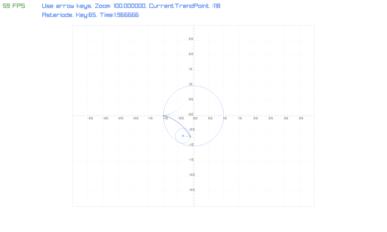
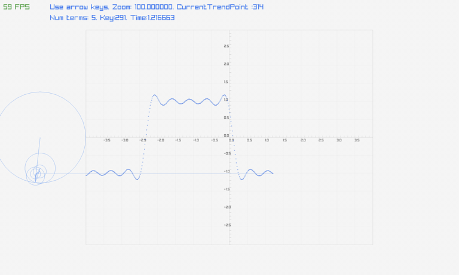
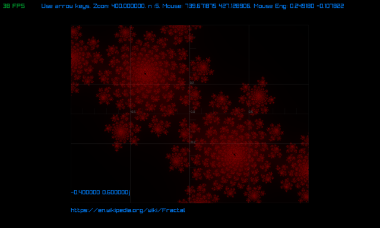

# fluffy-palm-tree

## Description

My adventures with Raylib.

Create a grid that can be populated by pixels in engineering units.

1. Display an Asteroid.
2. Display an animation of how a square wave can be created with Fourier series.
3. Create a display with a Julia set fractal. Can be zoomed into. Uses multiple threads
   for generation of the fractal.

It continues on the initial FourierWithRaylib project that
I created on [Github](https://github.com/willyclarke/fourierserieswithraylib.git).

The code in here is motivated from an article written by Markus Buchholz, published on medium.

His code can be found on [Github](https://github.com/markusbuchholz/Fourier-Series-in-Cpp-ImGui)

His description can be found on [Medium](https://markus-x-buchholz.medium.com/fourier-series-in-c-imgui-1587e866586e)

The cmake file is based on the example cmake file from the RayLib project.

This provides a base project template which builds with [CMake](https://cmake.org).

## Usage

To compile the example, use one of the following dependending on your build target...

### Desktop

Use the following to build for desktop (release / debug):

``` bash
rm -rf build
cmake -B build/release -DCMAKE_BUILD_TYPE=Release -GNinja
cmake --build build/release
```

``` bash
rm -rf build
cmake -B build/debug -DCMAKE_BUILD_TYPE=Debug -GNinja
cmake --build build/debug
```

## Know issues

Project fails to build on OSX when more recent version of Raylib is installed with Homebrew.

## Fixed issues

Ninja build does not work with CMake's Fetchcontent. So only "Unix Makefiles" are supported.

## Dependencies

* Gcc/G++
* make
* cmake
* Raylib - gets pulled down with cmake's Fetchcontent.
* On Linux some X-dev libraries are needed. CMake will complain and you need to install the missing libraries.

** For Ubuntu 23.04 the following apt-packages are needed:
```bash
sudo apt install make
sudo apt install gcc g++
sudo apt install libglfw3 libglfw3-dev libglfw3-doc
sudo apt install libxrandr-dev libxinerama-dev libxcursor-dev libxi-dev
```
### Cmake on Ubuntu
Cmake can be installed by both apt and snap on Ubuntu. Snap will install a newer version.
```bash
sudo snap install cmake --classic
```

## Images







## Runs on

* OSX 13.2 (22D49) - Apple M2 Max
* Ubuntu 20.04 - Parallels VM
* Ubuntu 20.04 - On metal
* Ubuntu 22.04 - Parallels VM

### Web - untested

Compiling for the web requires the [Emscripten SDK](https://emscripten.org/docs/getting_started/downloads.html):

``` bash
mkdir build
cd build
emcmake cmake .. -DPLATFORM=Web -DCMAKE_BUILD_TYPE=Release -DCMAKE_EXE_LINKER_FLAGS="-s USE_GLFW=3" -DCMAKE_EXECUTABLE_SUFFIX=".html"
emmake make
```
